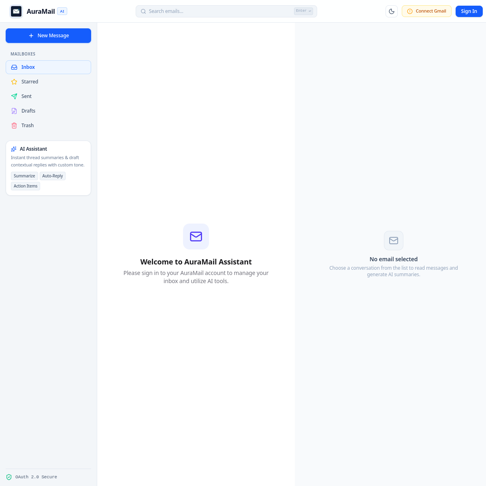

# AuraMail — Intelligent Email Assistant

AuraMail is a full-stack, AI-powered Gmail client. It brings inbox management, secure Google OAuth connection, AI summaries, and contextual reply drafting into one focused workspace.

## Project Name

AuraMail — Intelligent Email Assistant

## Problem Statement

Email threads can be long, repetitive, and difficult to action quickly. AuraMail helps users manage Gmail messages efficiently by surfacing concise AI-generated summaries, key points, action items, and deadlines, while also creating context-aware reply drafts in the desired tone. This reduces the time spent reading long conversations and writing routine responses.

## Features

### Core features

- Secure user registration and login using JWT-based authentication.
- Gmail connection through Google OAuth 2.0; OAuth tokens remain server-side and are encrypted at rest.
- Inbox browsing, folder navigation, search, email/thread reading, and pagination.
- Message actions: star, archive, mark read/unread, delete, and send email.
- Threaded conversations and replies sent through Gmail.
- Compose, save, edit, delete, and send drafts.
- Responsive interface with dark mode and mobile navigation.

### AI and bonus features

- AI thread or message summaries with key points, action items, questions, and deadlines.
- AI-generated contextual reply drafts with professional, friendly, concise, urgent, or casual tone options.
- Support for OpenAI, Gemini, and OpenAI-compatible AI providers.
- Sanitized HTML email rendering to reduce unsafe content risks.
- Optional Redis/BullMQ background jobs for AI and email-sync work, with a synchronous fallback.
- Socket.IO support for real-time events, activity logging, request validation, rate limiting, CORS, Helmet, compression, and structured error handling.

## Technology Stack

| Area | Technologies |
| --- | --- |
| Frontend | Next.js 16, React 19, Tailwind CSS, Zustand, TanStack Query, Axios, React Hot Toast, Lucide React |
| Backend | Node.js, Express 5, Mongoose, JWT, bcrypt, Socket.IO |
| Database | MongoDB / MongoDB Atlas |
| Email and authentication | Gmail API and Google OAuth 2.0 |
| AI services | OpenAI API, Google Gemini API, or an OpenAI-compatible API |
| Background processing | BullMQ and Redis (optional) |
| Security and validation | Helmet, CORS, express-rate-limit, express-validator, DOMPurify |
| Deployment | Vercel (frontend) and Render (backend API) |

## Screenshots

### Landing page




## Live Demo

The deployed frontend is available here:

`https://intelligent-email-assistant-nu.vercel.app/`

## Backend

The deployed backend API is available here:

`https://intelligent-email-assistant-j8tu.onrender.com`

The API base URL is:

`https://intelligent-email-assistant-j8tu.onrender.com/api`

The API health endpoint is available at `/api/health`.

## Setup Instructions

### Prerequisites

- Node.js 20 or later
- npm
- MongoDB locally or a MongoDB Atlas database
- A Google Cloud project with the Gmail API enabled
- An AI provider API key (OpenAI, Gemini, or compatible provider)
- Redis only if you want BullMQ background jobs

### Installation

1. Clone the repository and enter it.

   ```bash
   git clone <repository-url>
   cd "Intelligent Email Assistant"
   ```

2. Install backend dependencies.

   ```bash
   cd server
   npm install
   ```

3. Install frontend dependencies.

   ```bash
   cd ../client
   npm install
   ```

4. Create local environment files from the supplied examples.

   ```bash
   cd ../server
   cp .env.example .env

   cd ../client
   cp .env.example .env.local
   ```

5. Configure the environment variables listed below. Do not put real credentials in either example file.

6. In Google Cloud Console, create a **Web application** OAuth client, enable the Gmail API, and add this local authorized redirect URI:

   ```text
   http://localhost:5000/api/gmail/oauth/callback
   ```

7. Start MongoDB, or configure a MongoDB Atlas connection string in `server/.env`.

8. Run the backend in one terminal.

   ```bash
   cd server
   npm run dev
   ```

9. Run the frontend in another terminal.

   ```bash
   cd client
   npm run dev
   ```

10. Open `http://localhost:3000`, register or log in, then connect Gmail from the integration flow.

### Production deployment

- Deploy `server` to Render with `npm install` as the build command, `npm start` as the start command, and `/api/health` as the health-check path.
- Deploy `client` to Vercel with `client` set as the root directory.
- Set the frontend public API URL to the deployed backend URL ending in `/api`.
- Update the backend client origin and Google OAuth redirect URI to the deployed Vercel and backend URLs respectively.

See [deploy.md](deploy.md) for the full Render and Vercel deployment guide.

## Environment Variables

Copy the supplied `.env.example` files; configure these variable names locally or in your hosting provider. Values are deliberately not shown here.

### Server (`server/.env`)

| Variable | Required | Purpose |
| --- | --- | --- |
| `NODE_ENV` | No | Runtime environment |
| `PORT` | No | Backend server port |
| `CLIENT_URL` | Yes in production | Allowed frontend origin |
| `MONGODB_URI` | Yes | MongoDB connection string |
| `JWT_SECRET` | Yes | JWT signing secret |
| `JWT_EXPIRES_IN` | No | JWT expiration period |
| `GOOGLE_CLIENT_ID` | Yes for Gmail | Google OAuth client ID |
| `GOOGLE_CLIENT_SECRET` | Yes for Gmail | Google OAuth client secret |
| `GOOGLE_REDIRECT_URI` | Yes for Gmail | Google OAuth callback URL |
| `CREDENTIAL_ENCRYPTION_KEY` | Yes for Gmail | Key used to encrypt stored OAuth credentials |
| `AI_PROVIDER` | Yes for AI features | Selected AI provider |
| `AI_BASE_URL` | Only for compatible providers | OpenAI-compatible API base URL |
| `AI_API_KEY` | Yes for AI features | AI provider credential |
| `AI_MODEL` | Yes for AI features | Selected AI model |
| `REDIS_URL` | No | Redis connection for BullMQ |

### Client (`client/.env.local`)

| Variable | Required | Purpose |
| --- | --- | --- |
| `NEXT_PUBLIC_API_URL` | Yes | Public backend API base URL |

